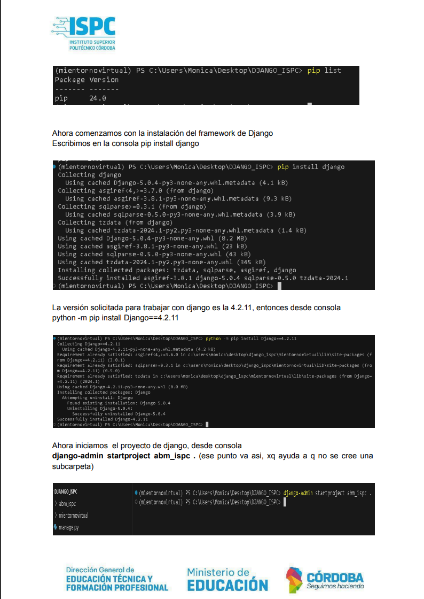
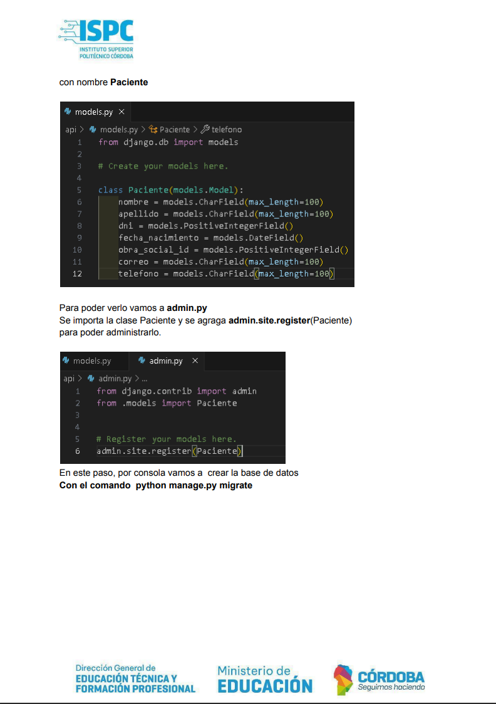
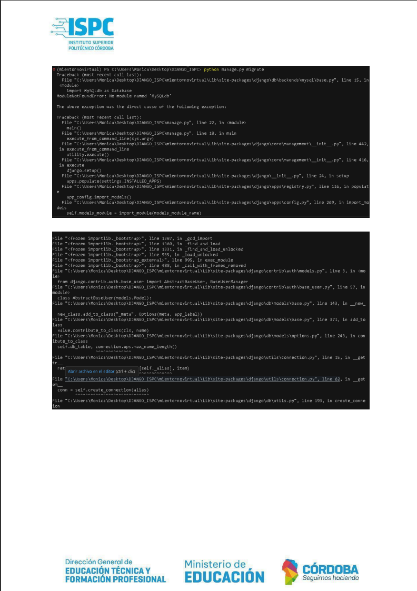
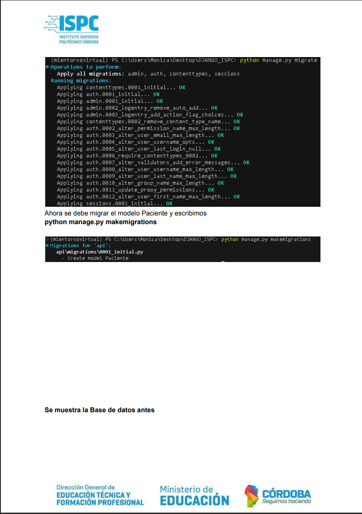
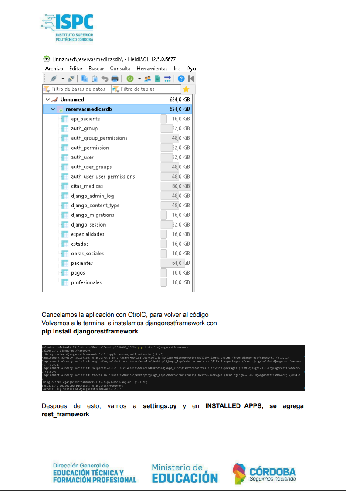

# Api Rest con Django

## Integrantes del Grupo

- Patricia Castillo
- Monica Antich
- Jesica Aramayo
- Alejo Lucero
- Matias Sorrentino

Cambiamos la informacion de DATEBASE.  
Seguimos con la creacion de las clases...

